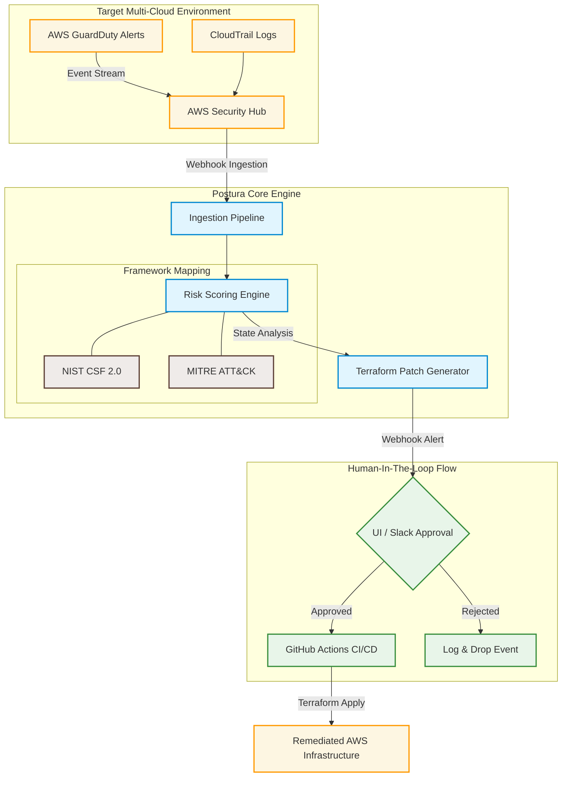
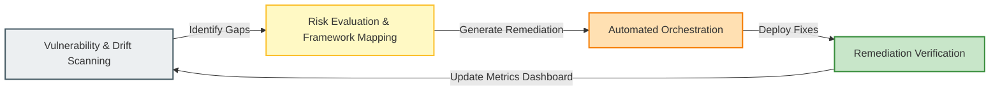

  

  
  
  

  

I am a Cybersecurity Graduate Student and the **Founder & CTO of Postura**. I specialize in building autonomous multi-cloud security remediation platforms, orchestrating event-driven AWS security automation, and implementing continuous compliance lifecycles.

> *"Securing systems isn't just about detecting threats — it's about automating remediation at scale."*

---

## 🚀 Featured Project: Postura
**Autonomous Multi-Cloud Security Remediation Platform**
*Real-time threat ingestion, risk scoring mapped to industry frameworks, and human-in-the-loop automated IaC drift repair.*

### 📐 System Architecture & Remediation Workflow

## 📌 Featured Projects

  
  

  
  

  
  

## 🛡️ Professional Experience & Workflows

**American Express — GRC Engineer** *(Jun 2025 – Present)*
- Run technology risk and security control assessments across payment and enterprise platforms using ServiceNow GRC and NIST CSF 2.0, reducing high-risk findings through prioritized remediation.
- Test and validate controls against NIST SP 800-53 Rev. 5 and PCI-DSS v4.0, improving audit readiness across 120+ security controls.
- Maintain enterprise risk registers in RSA Archer; partnered with technology teams to cut overdue risk items by 20%.
- Built executive risk/compliance dashboards in SQL and Power BI for KRI, control health, and remediation visibility.

**KPMG — GRC Engineer** *(Jan 2022 – Jul 2024)*
- Monitored 200+ security controls across banking operations against FFIEC, SOX, PCI-DSS, and NIST CSF using ServiceNow GRC.
- Conducted ITGC testing (SailPoint, Active Directory) covering access reviews, change management, and segregation of duties for SOX compliance.

### 🔄 Continuous GRC & Engineering Lifecycle

## 🔧 Technical Ecosystem

| Domain | Core Competencies & Tools |
|---|---|
| GRC & Risk Tools | ServiceNow GRC · RSA Archer · Qualys · SailPoint IdentityIQ · Jira · Confluence |
| Security Frameworks & Standards | NIST CSF 2.0 · NIST SP 800-53 Rev. 5 · PCI-DSS v4.0 · ISO 27001 · SOX ITGC · FFIEC · CIS Controls |
| Cloud & Infrastructure | IAM · GuardDuty · Security Hub · VPC Architecture · AWS Lambda · CloudTrail · AWS Config · Azure Policy |
| Data & Reporting | SQL · Power BI · Microsoft Excel · Risk Dashboards · KRI/KPI Analysis |
| DevOps & Engineering Operations | CI/CD Pipelines · Infrastructure Drift Management · GitOps Workflow Implementation |

### 🎖️ Certifications

- Google Cybersecurity Professional
- CompTIA Security+ (SY0-701)
- AWS Certified Solutions Architect – Associate *(in progress)*

  

## 🎓 Education & Background

**MS in Cybersecurity**
University of Maryland, Baltimore County (UMBC) | NSA Center of Academic Excellence (CAE-R/CD)
📅 Aug 2024 - May 2026

**B.Tech in Computer Engineering (Honors in Cybersecurity)**
St. Francis Institute of Technology
📅 2020 - 2024

## 📊 Engineering Activity

  
  

  

  

<!--START_SECTION:waka-->
<!-- snake animation renders here once the .github/workflows/snake.yml action runs -->

  

<!--END_SECTION:waka-->

## 🏆 Trophies

  

## 📫 Connect With Me

If you want to discuss multi-cloud automation architectures, zero-trust infrastructure engineering, or SaaS security patterns, reach out via LinkedIn or send an Email.

  

